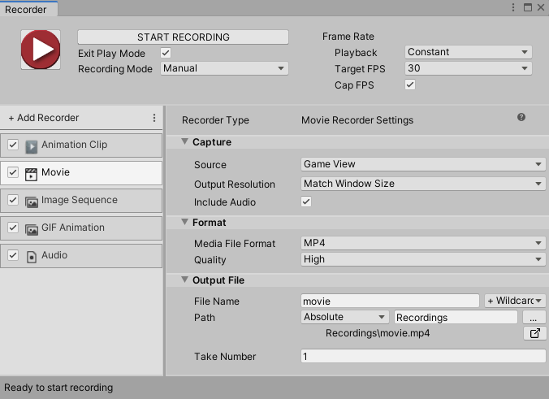

# Movie Recorder properties

The **Movie Recorder** generates videos in the MP4, WebM or MOV format. It does not support variable frame rates.

This page covers all properties specific to the Movie Recorder type.

> **Note:** To fully configure any Recorder, you must also set the global [Recording Properties](Recording.md) for the capture (properties shared with the other recorders, such as the frames to record).

The Movie Recorder properties fall into three main categories:
* [Capture](#capture)
* [Format](#format)
* [Output File](#output-file)

## Capture

Use this section to define the source and the content of your recording.

|Property||Function|
|:---|:---|:---|
| **Source** ||Specifies the input for the recording.|
|| Game View |Records frames rendered in the Game View.  Selecting this option displays the [Game View capture properties](#GameView). |
|| Targeted Camera |Records frames captured by a specific camera, even if the Game View does not use that camera.  Selecting this option displays the [Targeted Camera capture properties](#TargetedCamera).|
|| 360 View |Records a 360-degree video.  Selecting this option displays the [360 View capture properties](#360View).|
|| Render Texture Asset |Records frames rendered in a Render Texture.  Selecting this option displays the [Render Texture Asset capture properties](#RenderTextureAsset).|
|| Texture Sampling |Supersamples the source camera during the capture to generate anti-aliased images in the recording.  Selecting this option displays the [Texture Sampling capture properties](#TextureSampling).|
| **Flip Vertical** ||When you enable this option, the Recorder flips the output image vertically. This is useful to correct for systems that output video upside down.  This option is not available when you record the Game View.|
| **Include Audio** ||Enable this option to include audio in the recording.|

[!include]

[!include]

[!include]

[!include]

[!include]

## Format

Use this section to set up the media format in which you need to save the recorded images.

|Property|Function|
|:---|:---|
| **Media File Format** | The encoding format of the Recorder's output. Choose **MP4**, **WebM** or **MOV**. |
| **Include Alpha** | Enable this property to include the alpha channel in the recording. Disable it to only record the RGB channels.  This property is not available when the selected **Media File Format** or **Codec Format** doesn't support transparency, or when **Capture** is set to **Game View**. |
| **Quality** | The quality of the output movie: **Low**, **Medium**, or **High**. The lower the quality, the smaller the file size.  This property is only available when you set the **Media File Format** to **MP4** or **WebM**. |
| **Codec Format** | The video codec to use to encode the output file. Choose among a variety of [**Apple ProRes**](https://en.wikipedia.org/wiki/Apple_ProRes) codecs: **ProRes 4444 XQ**, **ProRes 4444**, **ProRes 422 HQ**, **ProRes 422**, **ProRes 422 LT** or **ProRes 422 Proxy**.  This property is only available when you set the **Media File Format** to **MOV**. |
| **Color Definition** | The video color space to use for the recording. Currently, the only available option is **HD Rec. 709**, which refers to HDTV standard.  This property is only available when you set the **Media File Format** to **MOV**. |

## Output File

Use this section to specify the output **Path** and **File Name** pattern to save the recorded animation clip.

> **Note:** [Output File properties](RecorderProperties.md) work the same for all types of recorders.
