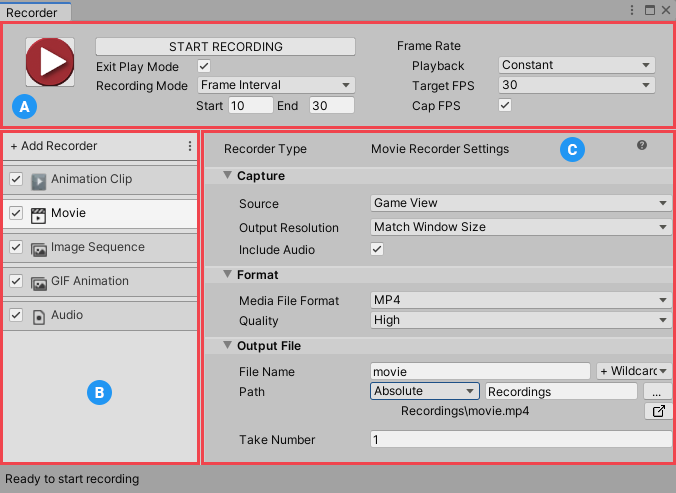

# Recording from the Recorder window

The Recorder window allows you to set up a list of Recorders to capture and export various types of data from your current Scene, in Play mode. This window includes recording controls that allow you to start and stop your recordings according to a specified frame or time interval, or manually.

> **Note:** If you installed [Timeline](https://docs.unity3d.com/Packages/com.unity.timeline@latest), you can control your recordings through [Recorder Clips](RecordingTimelineTrack.md) in Timeline tracks instead of using the Recorder window.

## Opening the Recorder window

From the Editor main menu, select **Window > General > Recorder > Recorder window**.

> **Note:** When you open the **Recorder** window, Unity restores the values from the last recording session.

## Recorder window overview

###  General recording properties

Use this section to simultaneously [start or stop recordings](RecorderWindowRecordingProperties.md) for all active Recorders of the Recorder List. You can specify the recording duration and frame rate.

###  Recorder list

Use this section to [create and manage your list of Recorders](RecorderManage.md). You can use more than one Recorder at the same time to capture Play-mode data. Each Recorder controls a single recording, and its properties depend on the type of data to record and the type of output to generate.

###  Recorder properties

Use this section to [set up the properties of a Recorder](RecorderProperties.md) selected in the Recorder list. Recorder properties include Capture, Format and Output File properties.
